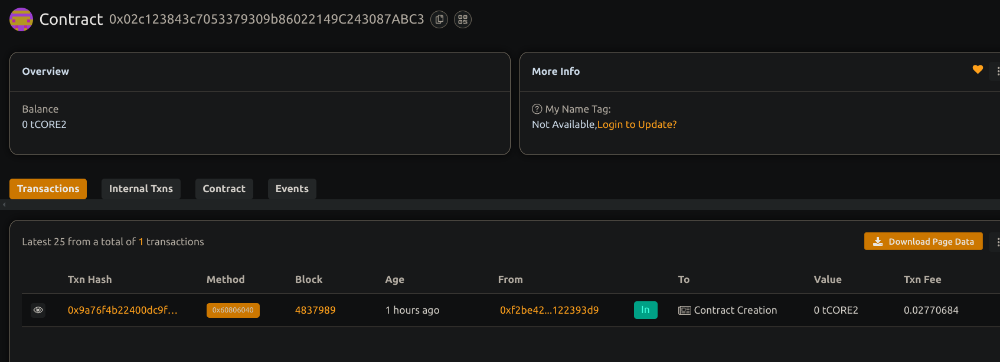

#####Flash Loan Arbitrage System

# Flash Loan Arbitrage System

# Project Description

This project implements a basic Flash Loan system allowing arbitrage opportunities between two decentralized exchanges (DEXes). It leverages flash loans to borrow tokens without upfront capital, executes arbitrage trades, and repays the loan within one transaction.

##  Project Vision

To provide a secure, gas-efficient, and flexible foundation for arbitrage trading using flash loans, enhancing liquidity and price efficiency in decentralized finance (DeFi) ecosystems.

####  Key Features

- Integration with flash loan providers.
- Basic arbitrage logic placeholder between two DEXes.
- Secure repayment of flash loan plus fees within the same transaction.
- 
- Ability for contract owner to withdraw payment

- 
###  Future Scope

- Integrate with real DEX protocols (Uniswap, Sushiswap).
- Add multi-token arbitrage strategies.
- Implement profit tracking and distribution.
- Extend to support multiple flash loan providers.
- Add automated monitoring and execution tools.

#### Contract details

0x02c123843c7053379309b86022149C243087ABC3

##my project is completed .
